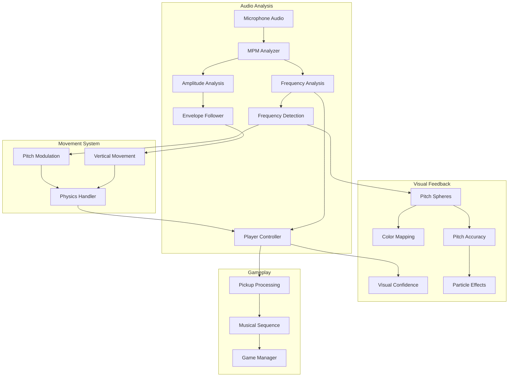
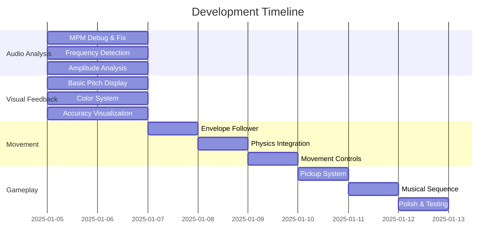
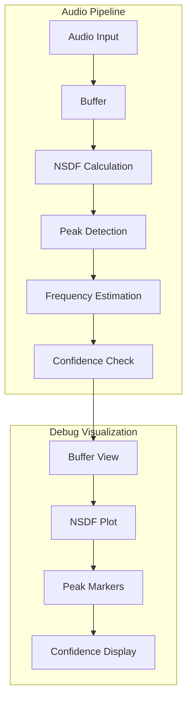
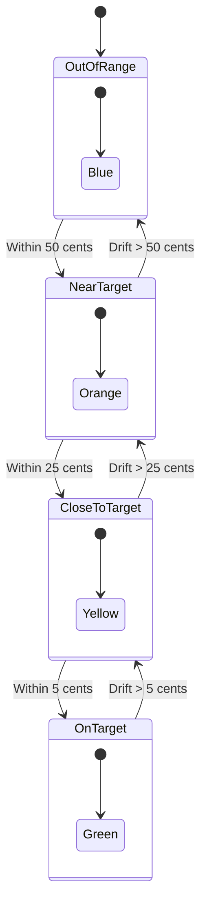
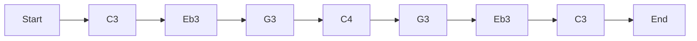
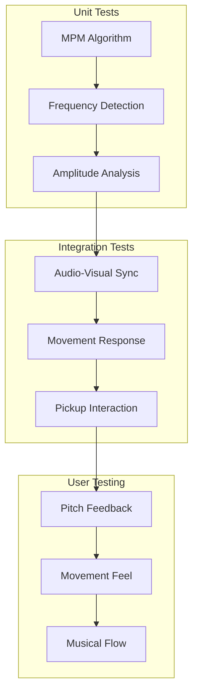

# Voice Driven World Interaction


## Scene Hierarchy and Components

```
UnityAudioProto*
├── AudioManager
│   ├── Audio Source
│   └── MPM Audio Analyzer
├── Directional Light
└── [BuildingBlock] Camera Rig
    └── TrackingSpace
        └── CenterEyeAnchor
            └── PitchVisualizer
                ├── CurrentPitchSphere
                │   └── Sphere
                ├── TargetPitchSphere
                │   └── Sphere
                └── Labels
                    ├── MinFrequencyLabel
                    ├── MaxFrequencyLabel
                    ├── FrequencyLabel
                    └── ConfidenceLabel
```

### Component Descriptions

#### MPM Audio Analyzer
Primary component for pitch detection and audio analysis. Configurable parameters:
- **Analysis Configuration**
  - Buffer Size: 2048 samples
  - Clarity Threshold: 0.71
  - Noise Floor: 0.001
  - Use Key Frequencies: true/false

- **Voice Range**
  - Min Frequency: 100 Hz
  - Max Frequency: 600 Hz

- **Debug Options**
  - Debug Mode: Enable detailed logging
  - Show Detailed Debug: Show extended debug info
  - Log Pitch Data: Log frequency and confidence
  - Visualize Buffers: Show buffer data

Dependencies:
- Requires AudioSource component
- Outputs: Frequency, Confidence, Clarity, Amplitude

#### PitchVisualizer
Visual feedback system for pitch matching. Parameters:
- **Layout**
  - Visualizer Distance: 2m from camera
  - Max Vertical Angle: 20 degrees
  - Vertical Offset: -0.2m
  - Sphere Base Scale: 0.05

- **Visualization Settings**
  - Target Frequency: 130.81 Hz (C3)
  - Frequency Tolerance: 5 Hz

- **Colors**
  - Target Color: Green (0, 1, 0, 0.8)
  - Normal Color: Blue (0, 0.5, 1, 0.8)
  - Close Color: Yellow (1, 1, 0, 0.8)
  - Matched Color: Red (1, 0, 0, 1)

- **Text Customization**
  - Font Size: 10
  - Label Offset: 0.15
  - Label Size: 0.02

Dependencies:
- Requires MPMAudioAnalyzer reference
- Requires TextMeshPro for labels
- Requires sphere primitives for visual feedback

### Installation Requirements

1. Unity Packages:
   - TextMeshPro
   - Universal Render Pipeline (URP)
   - XR Interaction Toolkit
   - Meta XR SDK

2. Scene Setup:
   ```
   1. Create base scene structure
   2. Add AudioManager with MPMAudioAnalyzer
   3. Add PitchVisualizer under CenterEyeAnchor
   4. Create sphere primitives
   5. Configure materials and shaders
   6. Set up text components
   ```

3. Material Requirements:
   - URP/Lit shader for spheres
   - Transparent materials for feedback
   - TextMeshPro font assets

## System Architecture



## Implementation Phases



## Core Systems Detail

### MPM Audio Analysis System



### Visual Feedback System



## C Minor Meditation Sequence



## Implementation Priorities

1. **Phase 1: Audio Analysis Foundation**
   - MPM implementation debugging
   - Real-time visualization tools
   - Frequency detection validation
   - Amplitude envelope system

2. **Phase 2: Visual Feedback System**
   - Pitch sphere behavior
   - Color transition system
   - Accuracy visualization
   - Musical note display

3. **Phase 3: Movement System**
   - Amplitude-based hovering
   - Pitch-based modulation
   - Physics integration
   - Movement bounds

4. **Phase 4: Gameplay Elements**
   - Pickup system
   - Musical sequence implementation
   - Progress tracking
   - Success feedback

## Testing Strategy



## Debug Visualization Tools

- NSDF Buffer View
- Frequency Spectrum Display
- Pitch Confidence Meter
- Amplitude Envelope Monitor
- Physics Debug View

## Visual Feedback Elements

1. **Pitch Accuracy Indicators**
   - Expanding/contracting aura
   - Particle system intensity
   - Color transitions
   - Distance lines

2. **Musical Information**
   - Current note name
   - Target note
   - Cents deviation
   - Octave indicator

3. **Performance Feedback**
   - Pitch history trail
   - Success particles
   - Collection effects
   - Level progress
