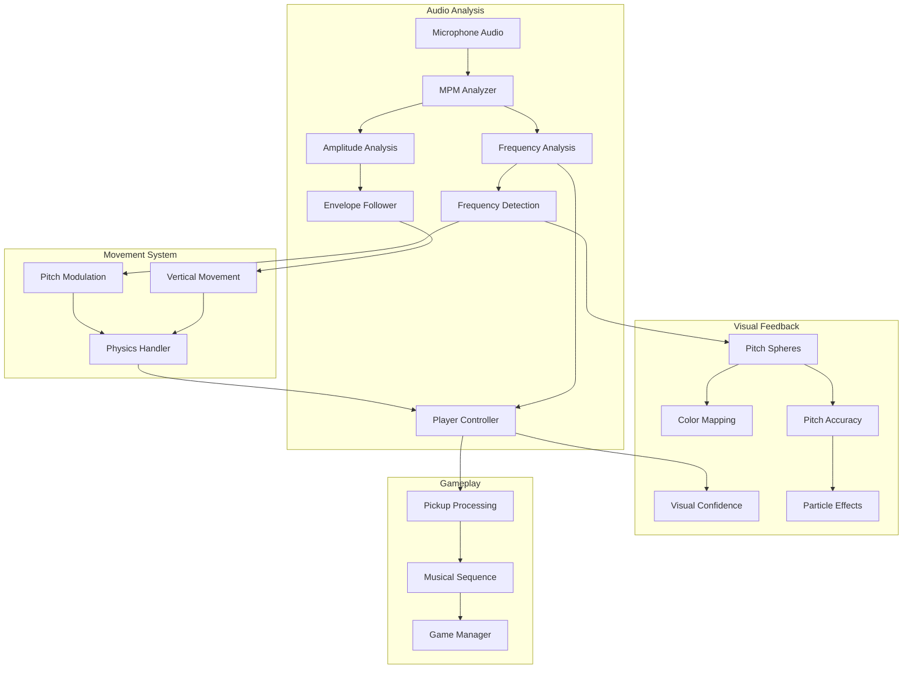
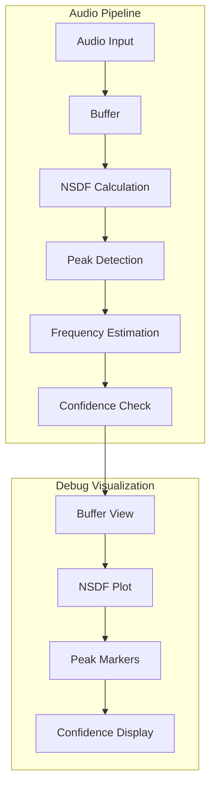
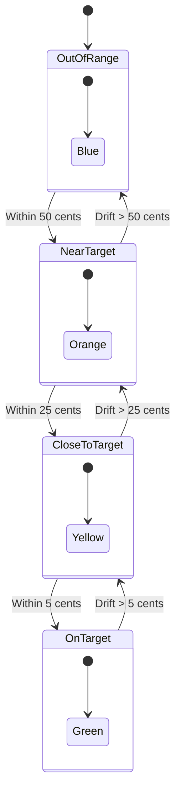
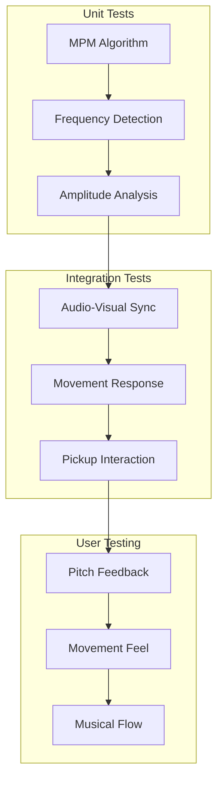
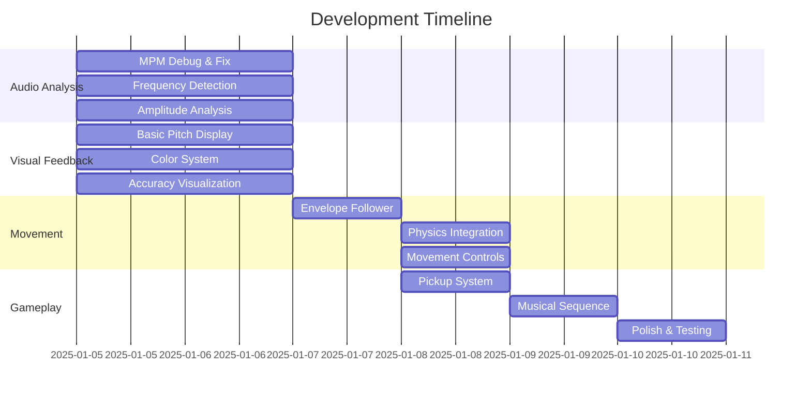

# VOX Interaction Model Design

## Overview


## Musical Design Philosophy

The experience uses voice input to create a novel form of musical interaction where spatial position directly maps to musical pitch. This creates an intuitive relationship between the player's voice, their movement in the virtual space, and musical progression.

### Core Musical-Spatial Mapping

The system maps musical frequencies to physical heights using logarithmic scaling:
- Lower frequencies (deeper notes) are positioned closer to the ground
- Higher frequencies (higher notes) are positioned higher in the space
- Height mapping follows standard musical intervals (logarithmic scaling)
- Base height (4m) corresponds to approximately 100Hz
- Maximum height (20m) corresponds to notes above C4 (middle C)

### Musical Sequence Design

The experience guides players through a meditative C minor progression:

```
C3  (130.81 Hz) → Base position
Eb3 (155.56 Hz) → Slightly higher
G3  (196.00 Hz) → Middle height
C4  (261.63 Hz) → Peak height
G3  (196.00 Hz) → Return to middle
Eb3 (155.56 Hz) → Lower again
C3  (130.81 Hz) → Return to base
```

This sequence was chosen to:
- Start with comfortable, achievable notes
- Create a natural arc of rising and falling
- Use musically related intervals
- Return to the starting note for closure

## Player Interaction

### Voice-Height Mapping

Players control their height through voice pitch:
1. Voice frequency is analyzed in real-time using the McLeod Pitch Method
2. Detected frequency is mapped to a target height using logarithmic scaling
3. Player's vertical position smoothly transitions to match their voice pitch
4. Visual feedback shows current and target heights
5. Confidence metrics ensure stable pitch detection

### Musical Pickup Collection

Musical pickups are placed at heights corresponding to their frequencies:
1. Each pickup represents a note in the sequence
2. Pickups are positioned ahead of the player in a path
3. Players must match the pickup's pitch to reach its height
4. Visual and audio feedback indicate proximity to correct pitch
5. Successful collection requires maintaining pitch for a brief duration

### Height Calculation

```
Height = baseHeight + (log(frequency) - log(minFreq)) / (log(maxFreq) - log(minFreq)) * (maxHeight - baseHeight)

Where:
- baseHeight = 4 meters (height at 100 Hz)
- maxHeight = 20 meters (height at maximum frequency)
- minFreq = 80 Hz (lowest supported note)
- maxFreq = 300 Hz (highest supported note)
```

## Visual Feedback

### Pickup Visualization
- Pickup color indicates sequence position
- Opacity changes based on current/target status
- Size pulses subtly to draw attention
- Forward path shows upcoming sequence
- Height lines show pitch targets

### Player Feedback
- Current pitch shown as floating sphere
- Color gradient indicates pitch accuracy
- Particle effects for successful matches
- Distance markers show height targets
- Frequency and confidence displays

## Implementation Details

### Key Components

1. **MPMAudioAnalyzer**
   - Real-time pitch detection
   - Frequency confidence calculation
   - Amplitude envelope following

2. **PlayerMovementController**
   - Voice-to-height mapping
   - Smooth height transitions
   - Ground tracking
   - Collision detection

3. **PickupManager**
   - Musical sequence management
   - Pickup spawning and positioning
   - Collection detection
   - Progress tracking

### Configuration Parameters

```csharp
[Header("Height Mapping")]
float baseHeight = 4f;     // Height at 100 Hz
float maxHeight = 20f;     // Maximum height
float minFreq = 80f;       // Lowest note (below C3)
float maxFreq = 300f;      // Highest note (above C4)

[Header("Musical Sequence")]
MusicalPickup[] sequence = {
    new MusicalPickup { frequency = 130.81f }, // C3
    new MusicalPickup { frequency = 155.56f }, // Eb3
    new MusicalPickup { frequency = 196.00f }, // G3
    new MusicalPickup { frequency = 261.63f }, // C4
    new MusicalPickup { frequency = 196.00f }, // G3
    new MusicalPickup { frequency = 155.56f }, // Eb3
    new MusicalPickup { frequency = 130.81f }  // C3
};
```


### Player Control Details

Two inputs control the character movement.

1. Audio of the user's voice  
    a. Sensor: device microphone  
    b. Controls: amplitude and frequency
    c. Mappings:  
    1. Amplitude drives elevation on the y axis with an envelope follower, feature a fairly rapid attack and very slow logarithmic release </i>
    2. Frequency modulates the y axis elevation within the "pitch fly zone", with a more responsive envelope.
2. Tilt of the headset 
    a. Sensor: gyroscope  
    b. Controls: azimuth plane  
    c. Mappings: forward, backward, left, right moves character slowly in that direction, 360 degrees on the azimuth plane </i>


## Scene Hierarchy and Components

```
UnityAudioProto2
├── AudioManager
│   └── MPMAudioAnalyzer (Pitch detection and voice processing)
├── [BuildingBlock] Camera Rig
│   ├── Player (Movement controller)
│   └── TrackingSpace
│       ├── CenterEyeAnchor
│       │   └── PitchVisualizer
│       ├── LeftEyeAnchor
│       └── RightEyeAnchor
├── TerrainManager (Procedural terrain generation)
├── LandmarkManager (Dynamic reference objects)
├── ReferenceGrid
├──PickupManager (Musical progression system) [In progress]
│   ├── PickupManager 
```
### Core Systems

1. **Voice Analysis (MPMAudioAnalyzer)**
   - Real-time pitch detection using McLeod Pitch Method
   - Amplitude envelope following
   - Frequency and clarity analysis

2. **Movement System (PlayerMovementController)**
   - Voice-driven elevation control
   - Pitch-based height modulation
   - Head-tilt based directional control
   - ADSR envelope for smooth transitions

3. **Terrain Generation (TerrainManager)**
   - Procedural mesh generation
   - Dynamic chunk loading
   - Collision detection
   - Performance-optimized updates

4. **Landmark System (LandmarkManager)**
   - Dynamic spawn system
   - Distance-based visual feedback
   - Cardinal direction markers
   - Spatial reference points

5. **Musical Progression (PickupManager)**
   - C minor meditation sequence
   - Visual waypoint system
   - Audio feedback (each pickup emits the target note)
   - Progress tracking (unclear how this is to be implemented)


## Setup Requirements

### Hardware
- Meta Quest or similar VR headset
- Microphone input
- Stereo audio output

### Software Dependencies
- Unity 2022.3 or later
- Meta XR SDK
- Universal Render Pipeline (URP)
- TextMeshPro


## System Architecture




## Core Systems Detail

### MPM Audio Analysis System



### Visual Feedback System



## C Minor Meditation Sequence


## Implementation Priorities

1. **Phase 1: Audio Analysis Foundation**
   - MPM implementation debugging
   - Real-time visualization tools
   - Frequency detection validation
   - Amplitude envelope system

2. **Phase 2: Visual Feedback System**
   - Pitch sphere behavior
   - Color transition system
   - Accuracy visualization
   - Musical note display

3. **Phase 3: Movement System**
   - Amplitude-based hovering
   - Pitch-based modulation
   - Physics integration
   - Movement bounds

4. **Phase 4: Gameplay Elements**
   - Pickup system
   - Musical sequence implementation
   - Progress tracking
   - Success feedback

## Testing Strategy



## Debug Visualization Tools

- NSDF Buffer View
- Frequency Spectrum Display
- Pitch Confidence Meter
- Amplitude Envelope Monitor
- Physics Debug View

## Visual Feedback Elements

1. **Pitch Accuracy Indicators**
   - Expanding/contracting aura
   - Particle system intensity
   - Color transitions
   - Distance lines

2. **Musical Information**
   - Current note name
   - Target note
   - Cents deviation
   - Octave indicator

3. **Performance Feedback**
   - Pitch history trail
   - Success particles
   - Collection effects
   - Level progress

## Implementation Phases


