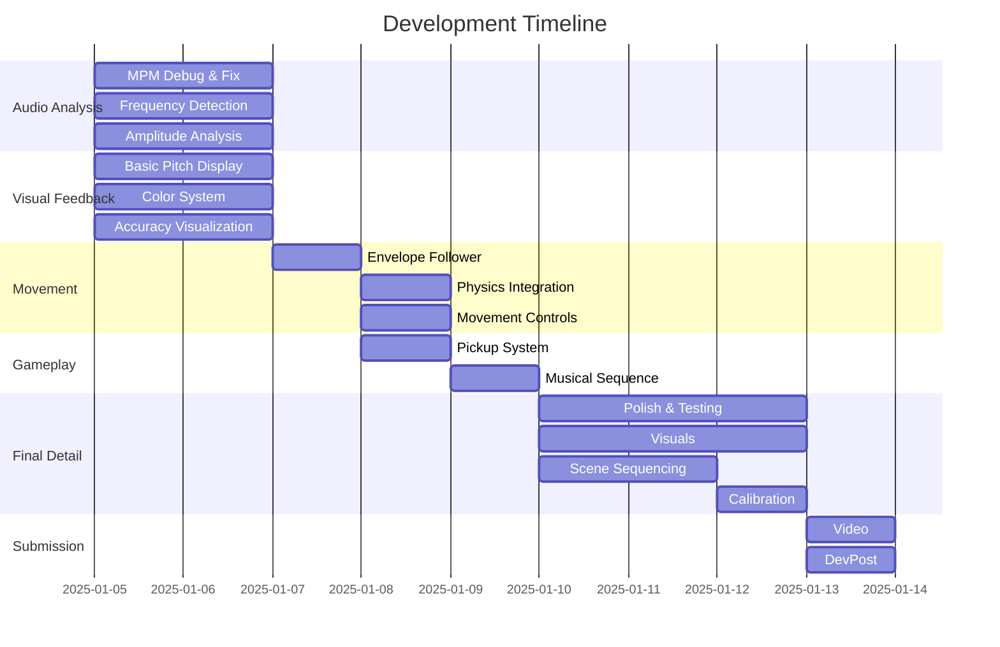

# VOXR - Meditative Singing Design Spec

## Overview
VOXR is designed to motivate people to sing in a meditative way, yielding therarpuetic benefits, such as a relaxed and euphoric state by slowing respiration, resonating the body and stimulating the vagus nerve.

## Core Interaction

Two inputs control the character movement.

1. Audio of the user's voice  
    a. Sensor: device microphone  
    b. Controls: amplitude and frequency
    c. Mappings:  
    1. Amplitude drives elevation on the y axis with an envelope follower, feature a fairly rapid attack and very slow logarithmic release </i>
    2. Frequency modulates the y axis elevation within the "pitch fly zone", with a more responsive envelope.
2. Tilt of the headset 
    a. Sensor: gyroscope  
    b. Controls: azimuth plane  
    c. Mappings: forward, backward, left, right moves character slowly in that direction, 360 degrees on the azimuth plane </i>

## Narrative Overview
1. Vocal Calibration / Onboarding - guide and measure player's voice.
2. 3rd POV MR - more familiarization and practice, big transition
3. 1st POV MR - fly with your voice to follow the guided melody

## Scene 1: 3rd Person [MR] Vocal Calibration / Onboarding

Tutorial guides people to sing in their lowest and highest comfortable pitches.  We measure and capture to adjust gameplay accordingly.

## Scene 2: 3rd Person [MR] Player Interaction


### A voice guided "golden snitch"

Objectives
- Gently introduce the interaction and world
- Start with comfortable, achievable notes
- Build suspense in the transition

The experience guides players through an exercise to continue familarization with voice control and head tilt, by guiding a "golden snitch"-like object through space to collide with objects in a musical way.

The voice and head tilt controls the currentPitch sphere as the main player.  In this 3rd person POV, we guide a player object freely through the world, within the MR room's bounds on the X and Z axis.  The height is limited in Y axis by the Height Calculation parameters driven by the amplitude and pitch of the voice.  X and Z axis and driven by head tilt.

### Pickup Visualization
TBD

### Height Calculation

```
Height = baseHeight + (log(frequency) - log(minFreq)) / (log(maxFreq) - log(minFreq)) * (maxHeight - baseHeight)

Where:
- baseHeight = 0.5 meter (height at 80 Hz)
- maxHeight = 2.5 meters (height at maximum frequency)
- minFreq = 80 Hz (lowest supported note)
- maxFreq = 300 Hz (highest supported note)
```


### Scene Hierarchy and Components
```
UnityAudioProto2
├── AudioManager
│   └── MPMAudioAnalyzer (Pitch detection and voice processing)
├── [BuildingBlock] Camera Rig
├──PickupManager 
│   ├── PickupManager
├──PitchVisualizer
│   ├── CurrentPitchSphere
│   ├── TargetPitchSphere
│   ├── Labels
│   ├── PlayerControl
├── TerrainManager

```


## Scene 3: 1st Person [VR] Player Interaction

Objectives
- Apex and payoff
- Give sensation of flying
- Stimulate and motivate singing

### Voice-Height Mapping

Players control their height through voice pitch:
1. Voice frequency is analyzed in real-time using the McLeod Pitch Method
2. Detected frequency is mapped to a target height using logarithmic scaling
3. Player's vertical position smoothly transitions to match their voice pitch
4. Visual feedback shows current and target heights
5. Confidence metrics ensure stable pitch detection

### Musical Pickup Collection

Musical pickups are placed at heights corresponding to their frequencies:
1. Each pickup represents a note in the sequence
2. Pickups are positioned ahead of the player in a path
3. Players must match the pickup's pitch to reach its height
4. Visual and audio feedback indicate proximity to correct pitch
5. Successful collection requires maintaining pitch for a brief duration

### Height Calculation

```
Height = baseHeight + (log(frequency) - log(minFreq)) / (log(maxFreq) - log(minFreq)) * (maxHeight - baseHeight)

Where:
- baseHeight = 4 meters (height at 100 Hz)
- maxHeight = 20 meters (height at maximum frequency)
- minFreq = 80 Hz (lowest supported note)
- maxFreq = 300 Hz (highest supported note)
```

## Visual Feedback

### Pickup Visualization
- Pickup color indicates sequence position
- Opacity changes based on current/target status
- Size pulses subtly to draw attention
- Forward path shows upcoming sequence
- Height lines show pitch targets

### Player Feedback
- Current pitch shown as floating sphere
- Color gradient indicates pitch accuracy
- Particle effects for successful matches
- Distance markers show height targets
- Frequency and confidence displays

## Implementation Details

### Musical Pickup Collection

Musical pickups are placed at heights corresponding to their frequencies:
1. Each pickup represents a note in the sequence
2. Pickups are positioned ahead of the player in a path
3. Players must match the pickup's pitch to reach its height
4. Visual and audio feedback indicate proximity to correct pitch
5. Successful collection requires maintaining pitch for a brief duration

### Key Components

1. **MPMAudioAnalyzer**
   - Real-time pitch detection
   - Frequency confidence calculation
   - Amplitude envelope following

2. **PlayerMovementController**
   - Voice-to-height mapping
   - Smooth height transitions
   - Ground tracking
   - Collision detection

3. **PickupManager**
   - Musical sequence management
   - Pickup spawning and positioning
   - Collection detection
   - Progress tracking

### Configuration Parameters

```csharp
[Header("Height Mapping")]
float baseHeight = 4f;     // Height at 100 Hz
float maxHeight = 20f;     // Maximum height
float minFreq = 80f;       // Lowest note (below C3)
float maxFreq = 300f;      // Highest note (above C4)

[Header("Musical Sequence")]
MusicalPickup[] sequence = {
    new MusicalPickup { frequency = 130.81f }, // C3
    new MusicalPickup { frequency = 155.56f }, // Eb3
    new MusicalPickup { frequency = 196.00f }, // G3
    new MusicalPickup { frequency = 261.63f }, // C4
    new MusicalPickup { frequency = 196.00f }, // G3
    new MusicalPickup { frequency = 155.56f }, // Eb3
    new MusicalPickup { frequency = 130.81f }  // C3
};
```

## Scene Hierarchy and Components

```
UnityAudioProto2
├── AudioManager
│   └── MPMAudioAnalyzer (Pitch detection and voice processing)
├── [BuildingBlock] Camera Rig
│   ├── Player (Movement controller)
│   └── TrackingSpace
│       ├── CenterEyeAnchor
│       │   └── PitchVisualizer
│       ├── LeftEyeAnchor
│       └── RightEyeAnchor
├── TerrainManager (Procedural terrain generation)
├── LandmarkManager (Dynamic reference objects)
├── ReferenceGrid
├──PickupManager (Musical progression system) [In progress]
│   ├── PickupManager 
```
### Core Systems

1. **Voice Analysis (MPMAudioAnalyzer)**
   - Real-time pitch detection using McLeod Pitch Method
   - Amplitude envelope following
   - Frequency and clarity analysis

2. **Movement System (PlayerMovementController)**
   - Voice-driven elevation control
   - Pitch-based height modulation
   - Head-tilt based directional control
   - ADSR envelope for smooth transitions
   - PlayerMovementController3rdPOV.cs is for the 3rdPOV scene
   - PlayerMovementController.cs is for the 1stPOV scene

3. **Terrain Generation (TerrainManager)**
   - Procedural mesh generation (perlin noise displacement)
   - Dynamic chunk loading
   - Collision detection
   - Performance-optimized updates

4. **Landmark System (LandmarkManager)**
   - Dynamic spawn system
   - Distance-based visual feedback
   - Cardinal direction markers
   - Spatial reference points

5. **Musical Progression (PickupManager)**
   - C minor meditation sequence
   - Visual waypoint system
   - Audio feedback (each pickup emits the target note)
   - Progress tracking (unclear how this is to be implemented)

## Setup Requirements

### Hardware
- Meta Quest or similar VR headset
- Microphone input
- Stereo audio output

### Software Dependencies
- Unity 2022.3 or later
- Meta XR SDK
- Universal Render Pipeline (URP)
- TextMeshPro

## Audio System Architecture


## Core Systems Detail

### MPM Audio Analysis System


### Visual Feedback System


## C Minor Meditation Sequence


## Implementation Priorities

1. **Phase 1: Audio Analysis Foundation**
   - MPM implementation debugging
   - Real-time visualization tools
   - Frequency detection validation
   - Amplitude envelope system

2. **Phase 2: Visual Feedback System**
   - Pitch sphere behavior
   - Color transition system
   - Accuracy visualization
   - Musical note display

3. **Phase 3: Movement System**
   - Amplitude-based hovering
   - Pitch-based modulation
   - Physics integration
   - Movement bounds

4. **Phase 4: Gameplay Elements**
   - Pickup system
   - Musical sequence implementation
   - Progress tracking
   - Success feedback

## Testing Strategy


## Debug Visualization Tools

- NSDF Buffer View
- Frequency Spectrum Display
- Pitch Confidence Meter
- Amplitude Envelope Monitor
- Physics Debug View

## Visual Feedback Elements

1. **Pitch Accuracy Indicators**
   - Expanding/contracting aura
   - Particle system intensity
   - Color transitions
   - Distance lines

2. **Musical Information**
   - Current note name
   - Target note
   - Cents deviation
   - Octave indicator

3. **Performance Feedback**
   - Pitch history trail
   - Success particles
   - Collection effects
   - Level progress

## Implementation Phases


